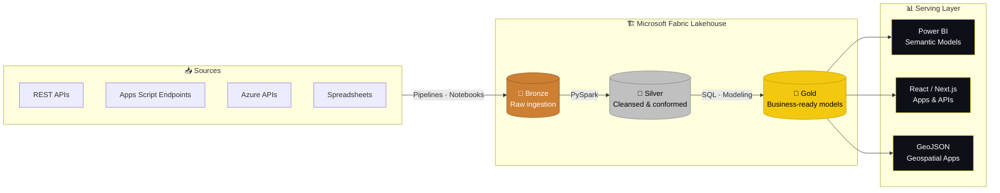
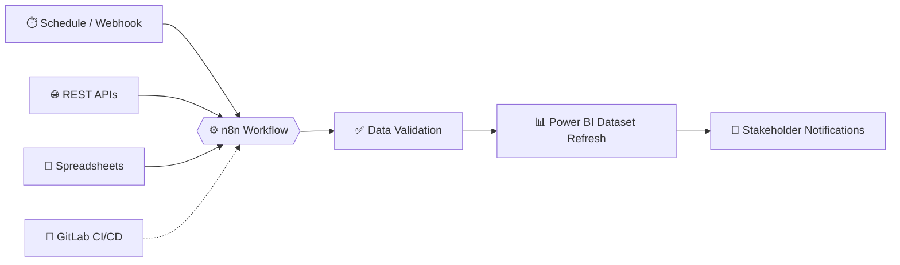

<!-- ===================================================== -->
<!--  HEADER                                                -->
<!--  Replace every YOUR_USERNAME with your GitHub username -->
<!-- ===================================================== -->

<div align="center">


<a href="https://github.com/DenverCoder1/readme-typing-svg">
  
</a>

<br/>

<a href="https://linkedin.com/in/matheus2002ac"></a>
<a href="https://portfolio-matheuss.netlify.app"></a>
<a href="mailto:matheus2002ac@gmail.com"></a>


</div>

---

## ⚡ About Me

I build the bridge between **raw operational data** and **executive decisions**.

With **4+ years** of experience across the public sector, higher education, and legislative operations, I turn fragmented data, disconnected systems, and manual workflows into **scalable data products, analytical applications, and decision-support solutions**. I design lakehouse architectures, ETL/ELT pipelines, and semantic models, and when a dashboard isn't enough, I build **React / Next.js applications** that put insights directly into business users' hands.

```sql
-- whoami.sql  |  Microsoft Fabric Warehouse
SELECT
    'Matheus Aragão Cavalcante'                            AS name,
    'Senior BI Developer & Data Engineer'                  AS role,
    'Lakehouse · ETL/ELT · Semantic Models · BI Apps'      AS focus,
    'Postgraduate in Data Engineering & AI (Xperiun)'      AS currently_learning,
    'English (full professional) · Portuguese (native)'    AS languages,
    'Remote & international opportunities'                 AS open_to
FROM   career.gold_layer
WHERE  business_impact > 0
  AND  manual_work     = 0;
```

---

## 📊 Impact at a Glance

<div align="center">

| | | | |
|:---:|:---:|:---:|:---:|
|  |  |  |  |
|  |  |  |  |

</div>

---

## 🔄 Pipeline Running in Production

<div align="center">


</div>

<!-- ============ DASHBOARD SHOWCASE (optional) ============
     Record a short GIF of one of your own dashboards (anonymized),
     save it as assets/dashboard-demo.gif in this repo and uncomment:

<div align="center">
  
  <br/><sub>Power BI executive dashboard — sample data</sub>
</div>
========================================================= -->

---

## 🚀 Featured Projects

### 🏗️ Enterprise Lakehouse Analytics Platform

End-to-end **Microsoft Fabric** cloud data platform that integrates **10+ heterogeneous sources** through REST APIs, Apps Script endpoints, Azure APIs, and spreadsheets, processing data with **PySpark** and **SQL** across a **Medallion Architecture** to deliver governed, analysis-ready datasets.

- 📉 **80% reduction** in recurring reporting time
- 🧱 Bronze → Silver → Gold layers with standardized ingestion and modeling
- 🗺️ Serves Power BI semantic models, APIs, and GeoJSON-based geospatial apps



    

<!-- Add the repository link here when public -->

---

### 🤖 BI Reporting Automation — n8n, APIs & Power BI

Automated BI workflow connecting **APIs, webhooks, spreadsheets, notification channels, and Power BI datasets**, integrated with **GitLab CI/CD** build pipelines, turning a manual refresh-validate-communicate cycle into a hands-off process.

- ⚙️ **60% fewer** refresh, validation, and communication steps
- 🔔 Stakeholders notified automatically when data is ready
- 🧪 Validation gates before every dataset refresh



   

---

### 🖥️ Analytical Platform with Data Pipeline

**TypeScript** analytical web platform that integrates REST API data, embedded dashboards, KPI cards, and interactive analytical pages, taking insights **beyond traditional dashboard delivery** and into purpose-built tools for business users.

   

<p align="left">
  <a href="https://portfolio-matheuss.netlify.app"></a>
</p>

---

## 🛠️ Tech Stack

**📊 BI & Analytics**

    

**⚙️ Data Engineering & Cloud**

     

**🗄️ Languages & Databases**

   

**🤖 Automation & Integration**

   

**💻 Analytical Apps & DevOps**

    

---

## 💼 Experience

| Role | Organization | Period | Focus |
|:---|:---|:---:|:---|
| **Senior Data Analyst** | City Hall of Fortaleza | 08/2025 – Present | End-to-end data & geospatial analytics ecosystem · Microsoft Fabric · 10+ sources · React / Next.js BI apps |
| **Administrative Process Analyst — BI & Analytics** | Unichristus | 12/2024 – 08/2025 | BI for Finance, HR & Sales · Python / Apps Script automation · TOTVS integrations |
| **Data Analyst** | ALECE — Ceará Legislative Assembly | 04/2024 – 11/2024 | Operational dashboards · Power BI · KPI reporting workflows |

---

## 🎓 Education & Certifications

- 🎓 **Postgraduate Program in Data Engineering and AI** — Xperiun *(2026 – Present)*
- 🎓 **Technologist Degree in Systems Analysis and Development** — Descomplica *(2024 – 2026)*
- 🎓 **Residency Program in Full Stack Development** — State University of Ceará *(2024 – 2025)*
- 🎓 **Bachelor's Degree in Business Administration** — Federal University of Ceará *(2021 – 2025)*

**Certifications:** Lakehouse with Microsoft Fabric (Microsoft) · Databricks with Spark (Xperiun) · Cloud Data Engineering (Xperiun) · Data Engineering on Google Cloud Platform (Coursera) · Google Data Analytics Specialization (Google)

---

## 📈 GitHub Analytics Dashboard

<div align="center">


<!-- Requires the snake GitHub Action (see setup instructions) -->
<picture>
  <source media="(prefers-color-scheme: dark)" srcset="https://raw.githubusercontent.com/YOUR_USERNAME/YOUR_USERNAME/output/github-snake-dark.svg" />
  <source media="(prefers-color-scheme: light)" srcset="https://raw.githubusercontent.com/YOUR_USERNAME/YOUR_USERNAME/output/github-snake.svg" />
  
</picture>

</div>

---

## 🤝 Let's Connect

I'm open to **remote and international opportunities** in BI Development, Analytics Engineering, and Data Engineering. If your team needs someone who can own the full path, **from raw source to business decision**, let's talk.

<div align="center">

<a href="https://linkedin.com/in/matheus2002ac"></a>
<a href="https://portfolio-matheuss.netlify.app"></a>
<a href="mailto:matheus2002ac@gmail.com"></a>


</div>
